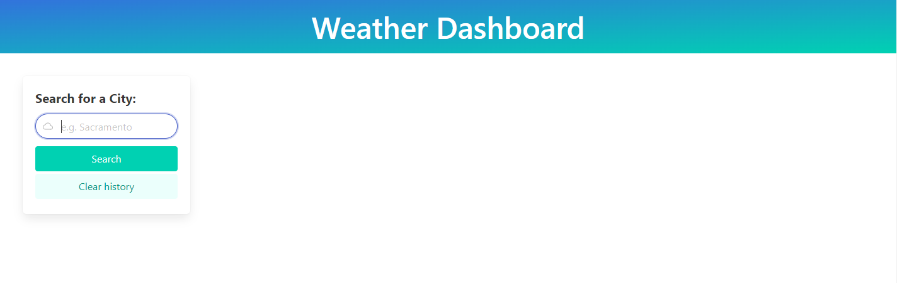
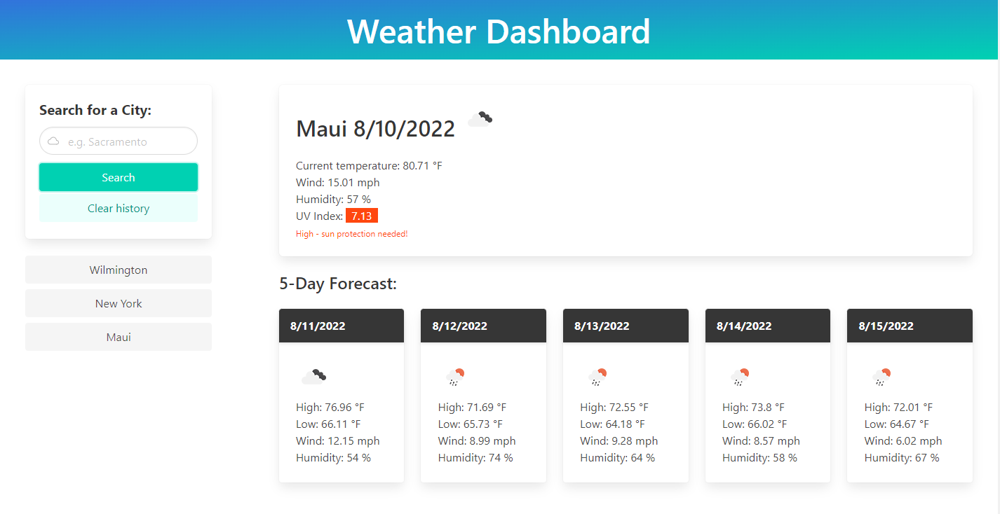

# Module #6 Challenge: Weather Dashboard

## Description
This project is a **weather dashboard challenge**. This project utilizes the ***OpenWeather API*** to fetch weather data for cities. It has a clean and responsive interface with dynamically updated HTML and CSS.

Implemented features:

* when the user searches for a city, they are presented with current and future weather conditions for that city
* each searched city is added to the user's search history
* when a city from the search history is clicked, the user is again presented with the current and future conditions for that city
* UV index is color coded:
  * green (low)
  * yellow (moderate)
  * orange (high)
  * reddish-pink (very high)
  * purple (extreme - stay indoors!!)
* icons that respresent the weather conditions

In addition, I have:

* deployed the live [URL](https://desguerra.github.io/weather-dashboard/)
* utilized [Bulma CSS](https://bulma.io/) framework for responsiveness and a more contemporary feel
* created a "clear history" button
* added help text corresponding to the current UV index of the city
* modified the application to resemble the mock-up functionality

Here is the link to [the completed challenge!](https://desguerra.github.io/weather-dashboard/)

## Table of Contents

* [Screenshots](#screenshots)
* [Credits](#credits)

## Screenshots

## Credits

* [OpenWeather API](https://openweathermap.org/)
* [Bulma CSS](https://bulma.io/)
